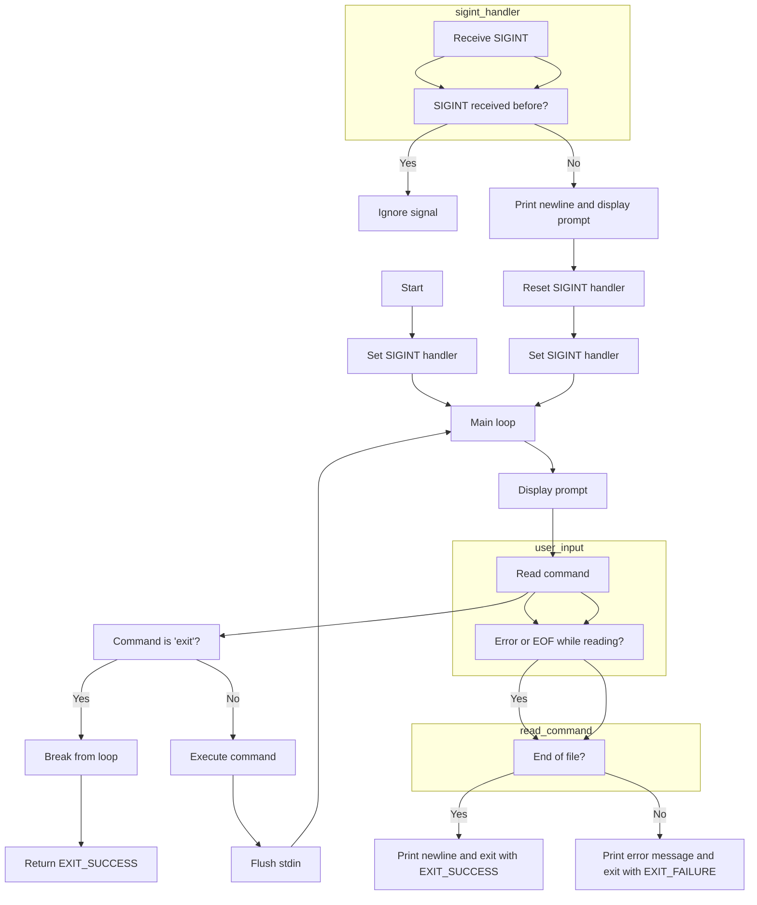

# holbertonschool-simple_shell

## What is Shell

Shell is a command-line interpreter providing a user interface to access the operating system's services. This project involves the development of a sh-type shell program (Bourne Shell), typically used through a terminal emulator.
What is it for

The shell interprets commands. It incorporates features such as process control, input/output redirection, and is used to write batch programs or scripts. Unix-like systems all have at least one Bourne shell-compatible interpreter.
Project Information
Environment

OS: Ubuntu 20.04 LTS
Language: C
Compiler: gcc 9.3.0
Editor: VIM 8.1.2269
Version control: Git
Style: Betty style
General Requirements

Use of vi, vim, emacs editors
Compilation on Ubuntu 14.04 LTS with gcc 4.8.4
Compliance with Betty style, without memory leaks
Output identical to sh (/bin/sh)
Authorized Functions

List of authorized functions such as execve, exit, fork, malloc, write, etc.
Compilation Link

gcc -Wall -Werror -Wextra -pedantic -std=gnu89 *.c -o hsh
Documentation

## Installation
Instructions for cloning the repository, changing directories, compiling, and running the shell in interactive or non-interactive mode.
Tests
Example of execution and output after compilation.

$ ./hsh
($) /bin/ls
hsh main.c shell.c
($)
($) exit
$

$ echo "/bin/ls" | ./hsh
hsh main.c shell.c test_ls_2
$
$ cat test_ls_2
/bin/ls
/bin/ls
$
$ cat test_ls_2 | ./hsh
hsh main.c shell.c test_ls_2
hsh main.c shell.c test_ls_2

## Files

`shell.h`
This header file contains function prototypes, macros, and necessary include statements for your custom shell program. It provides a central location for declaring functions and constants used across multiple source files.
 
`shell.c`
This source file contains the `main` function, which serves as the entry point for your custom shell program. It sets up the signal handler for SIGINT, enters an infinite loop to display the prompt, read commands, and execute them until the user enters the "exit" command.
 
`user_input.c`
This source file contains functions related to user input handling. The `user_input` function reads user input from stdin and stores it in the provided buffer. The `read_command` function reads a command from standard input and stores it in the given character array. The `sigint_handler` function handles the SIGINT signal, printing a newline character and resetting the signal handler to its default behavior.
 
`display_prompt.c`
This source file contains the `display_prompt` function, which prints the shell prompt to standard output. The prompt is represented by the dollar sign ($) followed by a space.
 
`exec_com.c`
This source file contains functions related to command execution. The `custom_execlp` function executes a file with given arguments using the `execve` system call. The `execute_command` function forks the current process and executes the command passed as a string, tokenizing it into arguments using spaces and tabs as delimiters. It handles the "exit" command, empty commands, and failure cases of the `execve` function.

## Flowchart of the Simple Shell

Shell Start: Initializing the environment.
Displaying the Command Prompt: In interactive mode, the shell displays a prompt.
Reading the Command: The shell reads the command line entered by the user.
Analyzing the Command: Identification of the command and arguments.
Executing the Command: Either a built-in command or an external command.
Managing Results: The shell handles results or errors.
Return to Command Prompt or Shell Termination: In interactive mode, return to the command prompt, otherwise termination of the shell.

## Authors
**Jérôme Romand, Néia Santos Nascimento, Sofiane Arfane.**
 

**Made for the HOLBERTON SCHOOL - cohort THO-0224**
